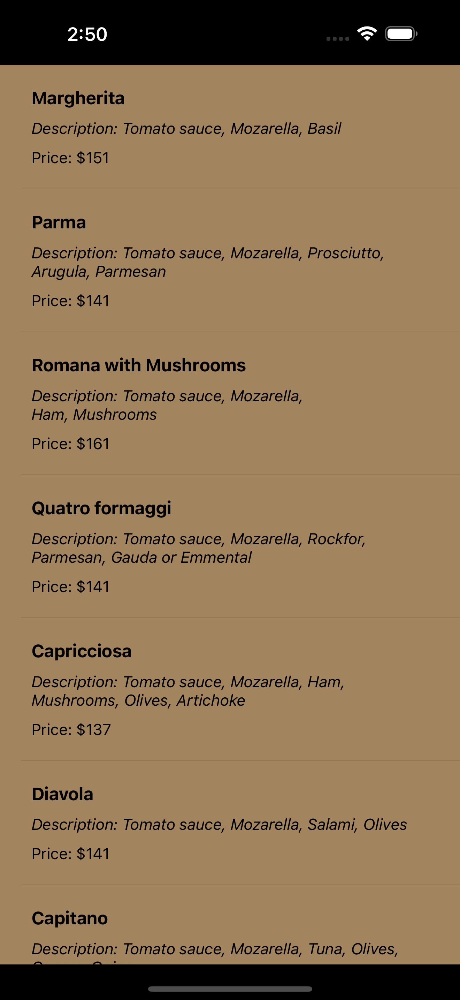

# 🍕 FoodApp – Your Ultimate Menu Explorer 🍝

FoodApp is a beautifully designed iOS application showcasing a variety of delicious food items. Built with **Swift**, this app efficiently retrieves data from an API, processes it, and displays it in an interactive table view.

---

## 🖼️ App Screenshot

---

## 🚀 Features

- **Dynamic Menu Display:** Browse through a diverse menu of food items.
- **Rich Food Details:** Each item includes:
  - Name
  - Description
  - Price
- **Efficient Data Fetching:** Utilizes API calls to fetch food data seamlessly.
- **Responsive Design:** A clean, user-friendly interface optimized for all iPhone screen sizes.

---

## 🛠️ Tech Stack

- **Language:** Swift
- **Framework:** UIKit
- **Networking:** URLSession
- **Database:** API-based (retrieves real-time data)
- **Architecture:** MVC (Model-View-Controller)

---

## 📖 How It Works

1. **Data Retrieval:**
   Fetches food item data from the server using an API call.
   
2. **Dynamic UI Updates:**
   Uses `UITableView` to dynamically populate the menu items.

3. **User Interaction:**
   Provides users with detailed information about each food item.

---
